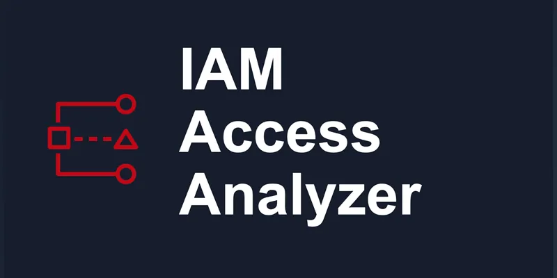
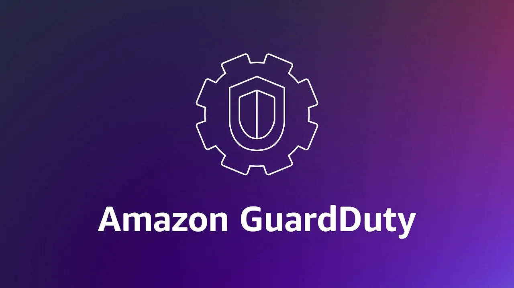
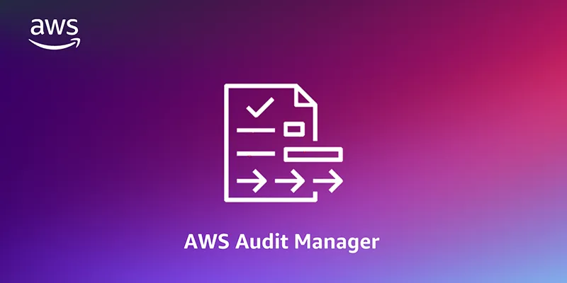
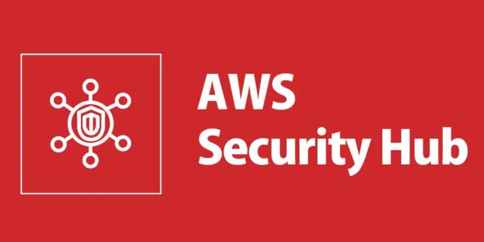
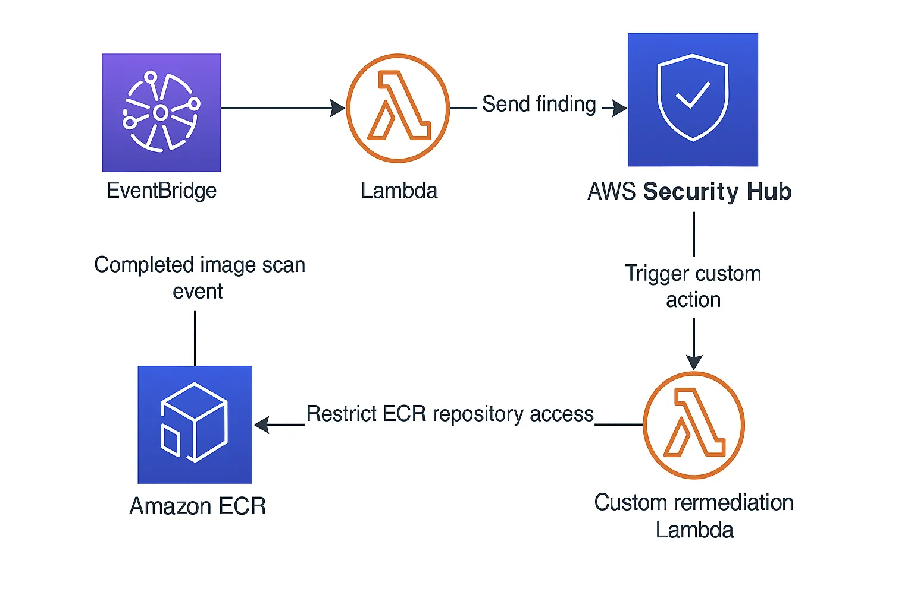
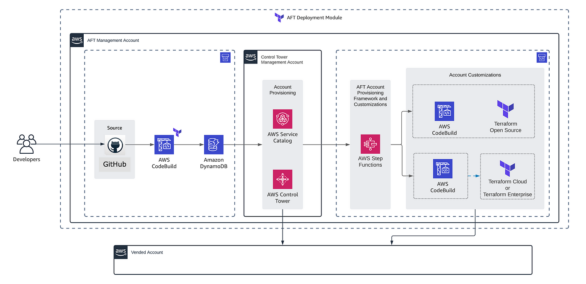

# 🚀 yl-ct-workshop

## ⚡ Prerequisites

Before starting the workshop, please ensure the following tools are installed:

* **Terraform** (installed via `tenv`): [YouLend Wiki Guide](https://youlend.atlassian.net/wiki/spaces/DevOps/pages/1375698985/Terraform+Terragrunt+Versioning+via+tenv+-+Transition+Plan)
* **Azure CLI**: [Installation Guide](https://learn.microsoft.com/en-us/cli/azure/install-azure-cli?view=azure-cli-latest)
* **Teleport CLI tools** (`tctl` and `tsh`): If you already use the `th` helper YouLend function, this is already installed. [Teleport Azure AD Integration Guide](https://goteleport.com/docs/admin-guides/access-controls/sso/azuread/#prerequisites)

## 📘 Introduction

Welcome to the **YouLend Control Tower Platform Workshop**!

In this workshop, we’ll explore the story of **YouFinance**, a fictional fintech startup spun out of YouLend, created to support small businesses through a modern **Control Tower architecture**. You’ll learn the foundations of Control Tower, key platform features, and build a working solution using the provided codebase.

👉 **Follow along, experiment, and most importantly—have fun!**

---

## ❓ Why This Workshop?

The YouLend Platform team has been evaluating Control Tower solutions for some time. Several third-party consultancies have pitched their services to us.

This workshop is designed to:

* Get you up to speed on what AWS Control Tower is.
* Understand its key features and strategic value.
* Enable you to build your own Control Tower using code.
* Prepare you to confidently engage in technical conversations about Control Tower.

By the end of this session, you’ll have both the theoretical and practical knowledge needed to assess and discuss Control Tower-based architectures.

---

## ✅ Dos & ❌ Don’ts

Before we begin, please review the following guidelines.

### 🔐 Credentials

You should have received credentials structured as follows:

| User Name | User Email | Password | Access Key (Mgmt Account) | Secret Key (Mgmt Account) | SSO Console Link | Terraform State Bucket | Teleport Sign-In Link | Slack Workspace | Datadog Sign-In Link |
|-----------|------------|----------|----------------------------|----------------------------|------------------|------------------------|------------------------|------------------|------------------------|
| *TBD*     | *TBD*      | *TBD*    | *TBD*                      | *TBD*                      | *TBD*            | *TBD*                  | *TBD*                  | *TBD*            | *TBD*                  |

### ✅ Dos

* Ask **as many questions** as you like during the session.
* Follow along with the hands-on tasks and **report bugs or errors**.
* Let the hosts know if they’re going **too fast or too slow**.
* Feel free to **request a quick break** if needed.

### ❌ Don’ts

* Do **not change** any credentials.
* Do **not change** any code, unless instructed to as this can cause errors.
* Do **not deploy** resources beyond the defined scope.


---

## 🗓️ Agenda

### **Day 1: Foundations & Architecture**

* What is AWS Control Tower?
* AWS Organizations & OU Strategies
* Control Tower Launch (Wizard vs. Terraform)
* Identity & Access Management (Teleport & Azure AD)
* OU Baselining
* Applying Control Tower Controls

---

### **Day 2: Security, Customisation & Wrap-up**

* Security Foundations
* Account Customisations (Account Factory with Terraform)
* Centralised Logging (Datadog)
* Feedback Session
* Recap of Final Architecture
* Strategic Considerations & Final Thoughts
* Resources & Materials (e.g., Medium Articles)

---

## Introduction to Control Tower

AWS Control Tower is a managed service that helps you set up and govern a secure, multi-account AWS environment based on AWS’s best practices. It’s not a single tool, but more like an orchestration layer that wires together multiple AWS services — like Organizations, IAM Identity Center (formerly AWS SSO), Config, CloudTrail, Service Catalog, and more — into a central place.

If you’re managing more than one AWS account, it’s worth thinking about. Control Tower provides:

* Guardrails (SCPs, Config rules) to keep things compliant
* Centralized identity access via IAM Identity Center
* Automated logging and monitoring configuration
* The ability to launch and enroll accounts in a consistent way

It removes a lot of the footguns and guesswork, since you’re building a structure that scales.

## AWS Organizations

AWS Organizations helps you centrally manage and govern your environment as you grow and scale your AWS resources. Using Organizations, you can:

* Create accounts and allocate resources
* Group accounts to organize your workflows
* Apply policies for governance
* Simplify billing by using a single payment method for all accounts

Having AWS Organizations enabled is the main prerequisite for running Control Tower.

### AWS Organizational Unit (OU)

An OU is a container for AWS accounts that allows you to apply a set of common policies to all AWS accounts within it. This lets you consolidate and administer them as a single unit.

#### OU Strategy for This Workshop

For this workshop, we’ll follow a simplified OU strategy. It’s not representative of the final recommendation, but keeps things easier to understand:

```
|- AWS Organization
    |- Root Account (Management Account)
    |- Security OU
        |- Security Account
        |- Logging Account
    |- Product OU
        |- Production Account
        |- Staging Account
        |- Development Account
    |- Platform OU
        |- AFT Account
```

## Ways to Deploy the Control Tower

We will explore two ways to deploy Control Tower:

* **AWS UI Launch Wizard**
  * Simple and guided
  * Creates all prerequisites including IAM roles and KMS keys
  * Only requires AWS Organizations to be enabled
  * Generates the AWS Security OU as well as, Security & Logging Accounts


* **Terraform**

  * Code stored in [03-control-tower](./03-control-tower) folder
  * Uses the Control Tower API
  * Lifecycle hooks required (changes in the manifest can lead to account recreation)
  * Useful for managing related infrastructure (e.g., Organizations, KMS keys)
  * Requires IAM roles to be pre-configured
  * Generates the Security OU BUT does NOT generate the AWS Accounts (It requires them to be pre-created)

We won’t run the Terraform module live, as the deployment process takes 30–60 minutes and was executed beforehand to save time.


---
## Step 0 - Control Tower Set Up

This step has already been completed in preparation for the workshop. We used the [Makefile](./Makefile) to automate the execution of the first three Terraform modules:

* [01-backend-init](./01-backend-init): Creates the S3 Backend for storing the Terraform state file (pre-provided for you).
* [02-aws-organizations](./02-aws-organizations): Enables AWS Organizations to manage accounts centrally.
* [03-control-tower](./03-control-tower): Deploys AWS Control Tower along with prerequisite IAM roles.

> ℹ️ These steps are skipped during the workshop to save time and ensure all participants start with a consistent baseline.

### MakeFile

It includes three stages: Each step is automated using a `Makefile` to streamline setup and deployment.

1. Initializing the backend.
2. Provisioning AWS Organizations
3. Enabling Control Tower configuration.


Before running, make sure you have a valid `terraform.tfvars` file in the root directory with email addresses for the security and logging accounts.

The Makefile validates this file, provisions the backend, injects the backend bucket into each module, and runs Terraform `plan` and `apply` in order.

#### How to Run

1. Ensure you have `terraform` and `make` installed on your system.
2. Create a `terraform.tfvars` file in the root directory with the following content:

```hcl
security_account_email   = "your+security@email.com"
logging_account_email    = "your+logging@email.com"
```

3. From the root of the repository, run:

```bash
make
```

> This will validate the `terraform.tfvars`, copy it into the appropriate directories, and run all Terraform steps in order.


---

## Step 1 - 🔧 Setup

If you haven’t already, run the following command and provide your credentials when prompted:

```sh
aws configure
```

Use these values when prompted:

* **AWS Access Key ID**: *\[provided to you]*
* **AWS Secret Access Key**: *\[provided to you]*
* **Default region name**: `eu-west-1`
* **Default output format**: `json`

```sh
az login
```
This will open a browser window. Select "Sign in with another account", then log in with the Azure credentials provided to you via Entra ID. Use the email provided to you.


---

### 🔍 Replace S3 Bucket Reference

Once configured, use your IDE to perform a **global search** for:

```
{{REPLACE_WITH_S3_BUCKET}}
```

Replace it with the actual **S3 bucket name** provided to you (e.g., `tfstate-control-tower-abc123`).

Alternatively, here’s how to do it using `find` and `sed` in bash:

```sh
find . -type f -name "*.tf" -exec sed -i '' 's/{{REPLACE_WITH_S3_BUCKET}}/tfstate-control-tower-abc123/g' {} +
```

> ⚠️ Make sure to use the actual bucket name provided to you instead of `tfstate-control-tower-abc123`.

---

## Step 2 - IAM with Teleport

With Control Tower running, we now want to start logging into the AWS accounts it manages. For this, we use **Teleport** as our identity broker to securely authenticate users through **Azure Entra ID**, and then into AWS.

---

### 📁 Navigate to the IAM Auth Module

Change to the directory:

```sh
cd ./04-iam-auth
```

You’ll find a file named `terraform.tfvars.example`. Copy and rename it:

```sh
cp terraform.tfvars.example terraform.tfvars
```

Update the values with those provided to you. Here's a template:

```hcl
john_user_email    = "user+john@email.com"
jane_user_email    = "user+jane@email.com"
teleport_saml      = "https://REPLACE_WITH_TENANT.teleport.sh:443/v1/webapi/saml/acs/ad"
```

> ℹ️ You can replace `john` and `jane` with any usernames you choose. We recommend using your YouLend email for at least one to test different access scenarios.

---

### 🚀 Deploy IAM Roles via Terraform

Run the following commands:

```sh
terraform init
terraform apply --auto-approve
```

This will:

* Generate IAM users with group-based permissions for access control testing
* Create an Enterprise Application in Microsoft Entra ID
* Attach the IAM users to that application

The output should include a link like this — **save it**:

```
https://d-92312321321.awsapps.com/
```

---

### 🛠️ Complete Manual Configuration in Teleport

1. **Sign in** to your Teleport tenant using the link provided.
2. Follow the official Teleport guide here: [Azure AD SAML Setup - Step 2/3](https://goteleport.com/docs/admin-guides/access-controls/sso/azuread/#prerequisites)
3. Then, complete the IAM Identity Center setup via: [AWS IAM Identity Center Guide](https://goteleport.com/docs/admin-guides/management/guides/aws-iam-identity-center/guide/)

---

### ✅ Logging in via Teleport

Once everything is set up:

* Go to the **AWS SSO link** output by Terraform.
* You’ll be redirected to **Teleport**.
* Choose **Login with Entra ID**.
* Use the Azure AD account provided to you.
* After authentication, you'll land on the AWS SSO homepage.

You are now ready to access your AWS accounts with proper role-based access through Teleport!

---

### 🔍 Validate Role-Based Access

Using the details from [Teleport's guide on creating custom Identity Center roles](https://goteleport.com/docs/admin-guides/management/guides/aws-iam-identity-center/guide/#creating-custom-identity-center-roles), you can assign different permission levels to the two IAM users.

To test this:

* Open a new **Incognito window**
* Log into Teleport using each user’s email address
* Since they’re automatically assigned to the Enterprise application by Terraform, **no manual assignment is required**

You should see that each user only has access to resources based on their assigned IAM roles.

---
## Step 3 - Baselining OU

By default, when you create an Organizational Unit (OU) in AWS Organizations, it is **not** enrolled into Control Tower. In this step, we'll establish a baseline so that each new OU gets enrolled into Control Tower with a consistent set of controls and guardrails.

We achieve this using a **CloudFormation stack** that is deployed and managed via Terraform.

---

### 📁 Navigate to OU Baseline Module

Change to the directory:

```sh
cd ./05-baseline-ou
```

You’ll find a file named `terraform.tfvars.example`. Copy and rename it:

```sh
cp terraform.tfvars.example terraform.tfvars
```

Update the values with those provided to you. Here's a template:

```hcl
platform_account_email = "user+platform@email.me"
```

> ℹ️ Keep the `+` symbol in the email (e.g., `john.doe+platform@example.com`) to utilize **email subaddressing**.

---

### 🚀 Deploy via Terraform

Run the following:

```sh
terraform init
terraform apply --auto-approve
```

This will:

* Create a new OU called **Platform**
* Register a new **Platform Account** within that OU
* Deploy a **CloudFormation stack** to enroll the Platform OU and account into AWS Control Tower

After this step, any resources or policies defined within Control Tower will automatically apply to the new OU.

---

## Step 4 - Control Tower Controls

AWS Control Tower provides multiple types of **Controls** to help govern AWS accounts:

* **Detective Controls** *(Config rules)*: Monitor and alert on policy violations
* **Proactive Controls** *(Hooks)*: Validate infrastructure **before** deployment using CloudFormation Guard (only applicable to CloudFormation stacks)
* **Preventive Controls** *(SCPs)*: Block restricted actions at the org level outright

Controls can be targeted by service, account, or audit requirement.

---

### 📁 Navigate to the Controls Module

Change to the directory:

```sh
cd ./06-controls
```

Run the following to deploy the control rules:

```sh
terraform init
terraform apply --auto-approve
```

This will deploy all three types of controls to the **AWS Production Account** in the **Product OU**.

---

### 🔍 Validate the Controls

After the controls are deployed:

1. Log in to the **AWS SSO console**
2. Generate **temporary credentials** for the AWS Production Account
3. Add them to your `~/.aws/credentials` file under a new profile:

```ini
[production]
aws_access_key_id = AKXXXXXXXXXXXXXXXX
aws_secret_access_key = UzJXXXXXXXXXXX
```

4. Navigate back to the `./06-controls` directory

5. Un-comment the following blocks in your code:

   * The `module "control_tower_controls_validation"` block in `main.tf`
   * The `provider "aws"` block in `terraform.tf`

6. Re-run Terraform:

```sh
terraform apply --auto-approve
```

You should observe **failures and errors** triggered by the controls — we’ll walk through and discuss them together during the live session.

---
## Step 5 - Security Foundations

In this section, we will deploy key **AWS Security Services** into our AWS accounts, leveraging the AWS Control Tower and Organizations setup to enable centralized monitoring and compliance.

---

### 🔐 Accessing the Security Account

To proceed, you’ll need **CLI access** to the **Security Account**.

We recommend one of the following methods:

* **Create a dedicated IAM user in Security Account** with an Administrator policy and configure its credentials using the AWS CLI.
* Or, **generate short-lived credentials** from the SSO console (as done with the Production Account) and paste them into your `~/.aws/credentials` file under the profile name `security`.

> ⚠️ Note: This module may take time to apply. If your credentials expire, simply re-fetch them.

---

### 📁 Navigate to the Security Foundations Module

```sh
cd ./07-security-foundations
```

Copy and rename the example tfvars file:

```sh
cp terraform.tfvars.example terraform.tfvars
```

Update the values with the credentials and information provided to you:

```hcl
management_account_email = "user@email.me"

logging_account_email    = "user+logging@email.me"
logging_account_id       = "123456789"

production_account_email = "user+production@email.me"
production_account_id    = "123456789"

slack_channel_id         = "C07EZ1ABC23"
slack_team_id            = "T07EA123LEP"
```

> ℹ️ Use **email subaddressing** with the `+` symbol (e.g., `john.doe+logging@example.com`)
> ✉️ AWS Account IDs can be fetched from the **SSO console**
> 💬 Slack team and channel IDs can be found by inspecting Slack workspace settings using the URL provided.

---

### 🚀 Run the Terraform Module

```sh
terraform init
terraform apply --auto-approve
```

This step will:

1. **Delegate the AWS Security Account** as an Organization Admin for security services
2. **Enable AWS Security Services** like Security Hub, Audit Manager, and Root Credential Monitoring on the Management Account
3. **Deploy Security Features** into the Security Account to act as a centralized control plane

---

### 🔍 IAM Access Analyzer



**IAM Access Analyzer** identifies:

* Unused IAM policies
* Permissions granting access to external accounts

To validate it works:
Edit `./07-security-foundations/main.tf`, and in the `security_foundation_security` module, set:

```hcl
validate_iam_access_analyzer = true
```

This will create a cross-account IAM role that triggers IAM Access Analyzer and simulate findings for evaluation.

We’ll review these findings together in the live session.

---

### Root Access Management

When using AWS Organizations, each member account still retains its own root user. That’s why part of your security foundation should be to centrally secure and restrict root user access across all accounts.

To validate it works:
Edit `./07-security-foundations/main.tf`, and in the `security_foundation_management` module, set:

```hcl
validate_org_root_features = true
```

This will create an S3 bucket that can **only be deleted by the AWS Root user**. To delete the bucket, run the following commands:

```sh
aws sts assume-root    \
  --region us-east-1 \
  --target-principal <my member account id> \
  --task-policy-arn arn:aws:iam::aws:policy/root-task/S3UnlockBucketPolicy
```

---

#### Example Output

```json
{
  "Credentials": {
    "AccessKeyId": "AS....XIG",
    "SecretAccessKey": "ao...QxG",
    "SessionToken": "IQ...SS",
    "Expiration": "2024-09-23T17:44:50+00:00"
  }
}
```

---

#### Using the Output

```sh
export AWS_ACCESS_KEY_ID=ASIA356SJWJITG32xxx
export AWS_SECRET_ACCESS_KEY=JFZzOAWWLocoq2of5Exxx
export AWS_SESSION_TOKEN=IQoJb3JpZ2luX2VjEMb//////////wEaCXVxxxx
```

---

#### Validate Root Identity

```sh
aws sts get-caller-identity
```

Expected output:

```json
{
  "UserId": "012345678901",
  "Account": "012345678901",
  "Arn": "arn:aws:iam::012345678901:root"
}
```

---

#### Delete the S3 Bucket

```sh
aws s3api delete-bucket-policy --bucket <bucket_name>
```
---
### Guard Duty



**Amazon GuardDuty** is a powerful threat detection service that continuously monitors your AWS environment for suspicious activity, misconfigurations, and anomalous behavior. It's a key part of any security foundation.

---

### 🛠️ How It Works in This Setup

* The `security_foundation_management` module enables GuardDuty for the AWS Organization and delegates the **AWS Security Account** as the GuardDuty administrator.
* The `security_foundation_security` module auto-enables GuardDuty across **all AWS Accounts** in the Organization, including any new ones added later.

> ⚠️ **Note**: It can take up to **24 hours** for GuardDuty configuration changes to propagate across all member accounts.

---

### ✅ Validating GuardDuty

To validate that GuardDuty is working as expected:

1. Log into the **AWS Production Account**.
2. Navigate to **GuardDuty** in the AWS Console.
3. Use the console option to **generate sample findings**.
4. Then, log into the **AWS Security Account** (GuardDuty admin account).
5. In the Security Account's GuardDuty console, you should now see the **sample findings** from the Production Account.

This confirms that all member account activity is being aggregated and monitored centrally from the Security Account.

---
### AWS Audit Manager



**AWS Audit Manager** helps you continuously audit your AWS usage by **automatically collecting evidence** to evaluate compliance with frameworks like **ISO/IEC 27001**, and others.

---

### 🛠️ How It Works in This Setup

* The `security_foundation_management` module enables Audit Manager for the AWS Organization and delegates the **AWS Security Account** as the Audit Manager admin.
* The `security_foundation_security` module:

  * Creates **three custom controls** to check:

    * CloudTrail is enabled
    * CloudTrail is encrypted
    * S3 public access is blocked at the account level
  * Creates an **assessment** to aggregate and report findings across accounts

> ⚠️ Once the assessment is created, **evidence collection starts automatically** for the defined controls. It may take up to **24 hours** for the evidence to appear in the Audit Manager console.

---
### AWS SecurityHub



**AWS Security Hub** is a centralized security management service that aggregates and prioritizes findings across your AWS environment. It integrates with AWS-native services and third-party tools like Snyk, and supports automation through native AWS integrations.

It seamlessly fits into CLI, API, and Infrastructure as Code workflows, making it ideal for automated and continuous monitoring.

---

### 🔧 What We’ll Configure

#### 1. Enable Security Hub Organization-wide

* The `security_foundation_management` module enables Security Hub for the entire AWS Organization.
* It delegates the **AWS Security Account** as the Security Hub administrator.

#### 2. Aggregate Findings Across Accounts

* The `security_foundation_security` module auto-enrolls all member accounts into Security Hub.

> ⚠️ Note: Accounts created **before** enabling Security Hub must be manually invited.

To auto-invite existing accounts, enable the following variable in `./modules/security-foundation-security`:

```hcl
module "security_foundation_security" {
  source = "./modules/security-foundation-security"
  providers = {
    aws = aws.security
  }
  enable_member_account_invites = true
  security_hub_member_invite    = local.security_hub_member_invite
}
```

And in `locals.tf`:

```hcl
security_hub_member_invite = {
  logging = {
    account_id = var.logging_account_id
    email      = var.logging_account_email
  }
}
```

We’ve scoped aggregation to specific governed AWS regions: `eu-west-1`, `eu-west-2`, `eu-west-3`, using:

To apply region aggregation, enable the following variable in `./modules/security-foundation-security`:

```hcl
module "security_foundation_security" {
  source = "./modules/security-foundation-security"
  providers = {
    aws = aws.security
  }
  enable_sechub_aggregator            = true
}
```

---

#### 3. Apply Custom Insights

Sometimes it’s best to narrow your view to the most critical risks. For example:

* Critical or High severity findings
* In production or customer-facing accounts

To apply custom insights, enable the following variable in `./modules/security-foundation-security`:

```hcl
module "security_foundation_security" {
  source = "./modules/security-foundation-security"
  providers = {
    aws = aws.security
  }
  enable_sechub_insights                   = true
}
```

---

#### 4. Apply Automation Rules

SecurityHub Automation Rules allow you to:

* Suppress irrelevant findings
* Change severity levels
* Add tags or notes
* Route findings based on account, resource, or region

In this setup, the module uses the `aws_securityhub_automation_rule` resource to:

* Elevate any **HIGH** severity finding in the **Management** or **Security Account** to **CRITICAL**
* Attach a note: *“Please address this ASAP, this is a high-risk account.”*

To apply automation rules, enable the following variable in `./modules/security-foundation-security`:

```hcl
module "security_foundation_security" {
  source = "./modules/security-foundation-security"
  providers = {
    aws = aws.security
  }
  enable_sechub_automation_rule            = true
}
```

---
### 5. Applying Custom Actions for Automated Remediations

Security Hub isn’t just for visibility and triage — it also enables **real-time, automated remediation** of security and compliance issues.

Thanks to its integrations with GuardDuty, Audit Manager, IAM Access Analyzer, and more, Security Hub can detect threats or misconfigurations and trigger **custom actions** via:

* AWS Lambda
* Systems Manager Automation Documents (SSM Docs)
* EventBridge and more

---

#### 🔄 Example Scenario

**Scenario**: John pushes a container image to Amazon ECR that includes known vulnerabilities and forgets to delete it.

**Remediation Flow:**



1. ECR’s built-in image scanning detects the vulnerability
2. EventBridge captures the scan event and routes it to Lambda
3. Lambda sends the event to Security Hub
4. A **custom action** in Security Hub triggers another Lambda that blocks the vulnerable image from being used

---

#### ⚙️ Enabling Remediation in Terraform

To apply the remediation workflow, set the following variable in `./modules/security-foundation-security`:

```hcl
module "security_foundation_security" {
  source = "./modules/security-foundation-security"
  providers = {
    aws = aws.security
  }
  enable_sechub_ecr_remediation = true
}
```

---

### 🧰 Support & Resources

📚 AWS provides a [CloudFormation repository on GitHub](https://github.com/aws-samples/aws-securityhub-automated-response-and-remediation) with many integration patterns. This ECR example was adapted from there.

To test this in a repeatable way, use the helper script:

```sh
./07-security-foundations/validate-sechub-custom-actions/ecr_test_trigger.sh
```

This script simulates the full lifecycle: push → scan → detect → trigger remediation.

Before running the script, ensure:

* Docker is installed and running
* Your AWS CLI is configured with access to the **AWS Security Account**

---
### 6. Notification Alerts with Custom Actions

Manually checking the Security Hub dashboard isn’t ideal — you want to be notified **only when it matters**.

In this step, we’ll integrate **AWS Security Hub with Slack** to receive real-time alerts when findings are triggered.

---

#### 🧭 Set Up Slack Integration

Using the **Slack workspace provided**, Follow the setup guide below until the CloudFormation step:
👉 [AWS Security Hub + Chatbot Integration Guide](https://aws.amazon.com/blogs/security/enabling-aws-security-hub-integration-with-aws-chatbot/)

Ensure your `terraform.tfvars` includes the correct values:

```hcl
slack_channel_id = "C07EZ1ABC23"
slack_team_id    = "T07EA123LEP"
```

---

#### ⚙️ Enable Slack Integration via Terraform

To activate the integration, modify the module declaration in `./modules/security-foundation-security`:

```hcl
module "security_foundation_security" {
  source = "./modules/security-foundation-security"
  providers = {
    aws = aws.security
  }
  enable_sechub_slack_integration = true
  slack_channel_id                = var.slack_channel_id
  slack_team_id                   = var.slack_team_id
}
```

---

#### ✅ Triggering an Alert

You can use the existing helper script to simulate a vulnerability scenario:

```sh
./07-security-foundations/validate-sechub-custom-actions/ecr_test_trigger.sh
```

Optionally, make a change (e.g., deploy a new ECR repo or application version) before rerunning the script.

You should then receive a **Slack alert** in the configured channel — confirming successful integration and alert routing.

---
## Step 6 - Account Factory Terraform

### Setting up the AFT

**Account Factory Terraform (AFT)** is an AWS framework that enables automated, consistent **account provisioning and customization** using **Terraform**, our preferred infrastructure-as-code tool.



---

### 🔄 How AFT Works

The provisioning flow moves from **left to right** as follows:

1. An account is requested via the **AFT Account Request** repository
2. **Provisioning-time customizations** are applied in the **AFT Management Account**
3. **Global customizations** are applied inside each new account via an auto-created pipeline
4. **Account-specific customizations**, if defined, are executed inside the relevant accounts

> AWS recommends managing AFT from a dedicated AWS account inside a **Platform** or **Infrastructure OU**.
> We’ll use the **Platform Account** created earlier in [05-baseline-ou](./05-baseline-ou/)

---

### 📁 Navigate to the AFT Setup Folder

```sh
cd ./08-aft-setup
```

Copy the example file:

```sh
cp terraform.tfvars.example terraform.tfvars
```

Update the values:

```hcl
security_account_id      = "123456789"
logging_account_id       = "123456789"
platform_account_id      = "123456789012"
github_organization      = "MY_GITHUB_ORG_NAME"
```

> Use your **personal or work GitHub account** — just make sure the repos match the names below.
> Replace all `account_id` values using the SSO console.

---

### 📂 Review the AFT Repositories Structure

```txt
./08-aft-setup/aft-repos
├── aft-account-customizations/
├── aft-account-provisioning-customizations/
├── aft-account-request/
└── aft-global-customizations/
```

#### Repo Purpose:

* `aft-account-request`: defines account creation requests
* `aft-global-customizations`: applies to **all** accounts
* `aft-account-customizations`: account-specific customization templates
* `aft-account-provisioning-customizations`: applies only at **provisioning time**

> ⚠️ **AFT does not support monorepo setups.**

You must push each directory to a **separate GitHub repo** under your account. Use the **exact same repo name** as the folder.

---

### 🚀 Deploying AFT

This module deploys the full AFT infrastructure into the **AWS Management Account**, as shown in the architecture diagram. It references the GitHub repos you just pushed.

Once the deployment is successful, a series of **Service Catalog permissions** will automatically configure relationships between the **Platform** and **Management Accounts** to allow safe, governed account vending.

Stay tuned in the workshop to observe and validate each step live.
