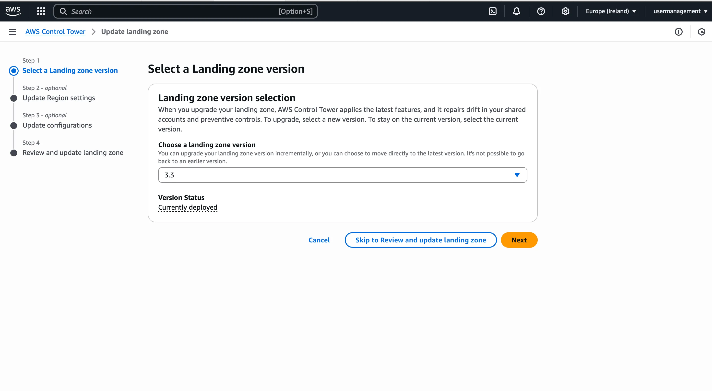
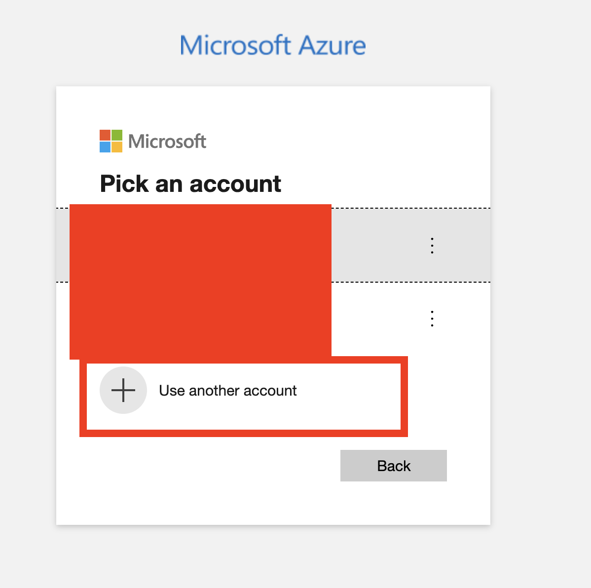

# 🚀 yl-ct-workshop

## ⚡ Prerequisites

Before starting the workshop, please ensure the following tools are installed:

* **Terraform** (installed via `tenv`): [YouLend Wiki Guide](https://youlend.atlassian.net/wiki/spaces/DevOps/pages/1375698985/Terraform+Terragrunt+Versioning+via+tenv+-+Transition+Plan)
* **Azure CLI**: [Installation Guide](https://learn.microsoft.com/en-us/cli/azure/install-azure-cli?view=azure-cli-latest)
* **Teleport CLI tools** (`tctl` and `tsh`): If you already use the `th` helper YouLend function, this is already installed. [Teleport Azure AD Integration Guide](https://goteleport.com/docs/admin-guides/access-controls/sso/azuread/#prerequisites)

## 📘 Introduction

Welcome to the **YouLend Control Tower Platform Workshop**!

In this workshop, we’ll explore the story of **YouFinance**, a fictional fintech startup spun out of YouLend, created to support small businesses through a modern **Control Tower architecture**. You’ll learn the foundations of Control Tower, key platform features, and build a working solution using the provided codebase.

👉 **Follow along, experiment, and most importantly—have fun!**

---

## ❓ Why This Workshop?

The YouLend Platform team has been evaluating Control Tower solutions for some time. Several third-party consultancies have pitched their services to us.

This workshop is designed to:

* Get you up to speed on what AWS Control Tower is.
* Understand its key features and strategic value.
* Enable you to build your own Control Tower using code.
* Prepare you to confidently engage in technical conversations about Control Tower.

By the end of this session, you’ll have both the theoretical and practical knowledge needed to assess and discuss Control Tower-based architectures.

---

## ✅ Dos & ❌ Don’ts

Before we begin, please review the following guidelines.

### 🔐 Credentials

You should have received credentials structured as follows:

| User Name | User Email | Password | Access Key (Mgmt Account) | Secret Key (Mgmt Account) | SSO Console Link | Terraform State Bucket | Teleport Sign-In Link |
|-----------|------------|----------|----------------------------|----------------------------|------------------|------------------------|------------------------|
| *TBD*     | *TBD*      | *TBD*    | *TBD*                      | *TBD*                      | *TBD*            | *TBD*                  | *TBD*                  |               |
---

### ✅ Dos

* Ask **as many questions** as you like during the session.
* Follow along with the hands-on tasks and **report bugs or errors**.
* Let the hosts know if they’re going **too fast or too slow**.
* Feel free to **request a quick break** if needed.

### ❌ Don’ts

* Do **not change** any credentials.
* Do **not deploy** resources beyond the defined scope.

---

## 🗓️ Agenda

### **Day 1: Foundations & Architecture**

* What is AWS Control Tower?
* AWS Organizations & OU Strategies
* Control Tower Launch (Wizard vs. Terraform)
* Identity & Access Management (Teleport & Azure AD)
* OU Baselining
* Detective & Preventive Controls

---

### **Day 2: Security, Customisation & Wrap-up**

* Security Foundations
* Account Customisations (Account Factory with Terraform)
* Centralised Logging (Datadog)
* Feedback Session
* Recap of Final Architecture
* Strategic Considerations & Final Thoughts
* Resources & Materials (e.g., Medium Articles)

---

## Introduction to Control Tower

AWS Control Tower is a managed service that helps you set up and govern a secure, multi-account AWS environment based on AWS’s best practices. It’s not a single tool, but more like an orchestration layer that wires together multiple AWS services — like Organizations, IAM Identity Center (formerly AWS SSO), Config, CloudTrail, Service Catalog, and more — into a central place.

If you’re managing more than one AWS account, it’s worth thinking about. Control Tower provides:

* Guardrails (SCPs, Config rules) to keep things compliant
* Centralized identity access via IAM Identity Center
* Automated logging and monitoring configuration
* The ability to launch and enroll accounts in a consistent way

It removes a lot of the footguns and guesswork, since you’re building a structure that scales.

## AWS Organizations

AWS Organizations helps you centrally manage and govern your environment as you grow and scale your AWS resources. Using Organizations, you can:

* Create accounts and allocate resources
* Group accounts to organize your workflows
* Apply policies for governance
* Simplify billing by using a single payment method for all accounts

Having AWS Organizations enabled is the main prerequisite for running Control Tower.

### AWS Organizational Unit (OU)

An OU is a container for AWS accounts that allows you to apply a set of common policies to all AWS accounts within it. This lets you consolidate and administer them as a single unit.

#### OU Strategy for This Workshop

For this workshop, we’ll follow a simplified OU strategy. It’s not representative of the final recommendation, but keeps things easier to understand:

```
|- AWS Organization
    |- Root Account (Management Account)
    |- Security OU
        |- Security Account
        |- Logging Account
    |- Product OU
        |- Production Account
        |- Staging Account
        |- Development Account
    |- Platform OU
        |- AFT Account
```

## Ways to Deploy the Control Tower

We will explore two ways to deploy Control Tower:

* **AWS UI Launch Wizard**
  * Simple and guided
  * Creates all prerequisites including IAM roles and KMS keys
  * Only requires AWS Organizations to be enabled
  * Generates the AWS Security OU as well as, Security & Logging Accounts




* **Terraform**

  * Code stored in [03-control-tower](./03-control-tower) folder
  * Uses the Control Tower API
  * Lifecycle hooks required (changes in the manifest can lead to account recreation)
  * Useful for managing related infrastructure (e.g., Organizations, KMS keys)
  * Requires IAM roles to be pre-configured
  * Generates the Security OU BUT does NOT generate the AWS Accounts (It requires them to be pre-created)

We won’t run the Terraform module live, as the deployment process takes 30–60 minutes and was executed beforehand to save time.


---
## Step 0 - Control Tower Set Up

This step has already been completed in preparation for the workshop. We used the [Makefile](./Makefile) to automate the execution of the first three Terraform modules:

* [01-backend-init](./01-backend-init): Creates the S3 Backend for storing the Terraform state file (pre-provided for you).
* [02-aws-organizations](./02-aws-organizations): Enables AWS Organizations to manage accounts centrally.
* [03-control-tower](./03-control-tower): Deploys AWS Control Tower along with prerequisite IAM roles.

> ℹ️ These steps are skipped during the workshop to save time and ensure all participants start with a consistent baseline.

### MakeFile

It includes three stages: Each step is automated using a `Makefile` to streamline setup and deployment.

1. Initializing the backend.
2. Provisioning AWS Organizations
3. Enabling Control Tower configuration.


Before running, make sure you have a valid `terraform.tfvars` file in the root directory with email addresses for the security and logging accounts.

The Makefile validates this file, provisions the backend, injects the backend bucket into each module, and runs Terraform `plan` and `apply` in order.

#### How to Run

1. Ensure you have `terraform` and `make` installed on your system.
2. Create a `terraform.tfvars` file in the root directory with the following content:

```hcl
security_account_email   = "your+security@email.com"
logging_account_email    = "your+logging@email.com"
```

3. From the root of the repository, run:

```bash
make
```

> This will validate the `terraform.tfvars`, copy it into the appropriate directories, and run all Terraform steps in order.


---

## Step 1 - 🔧 Setup

If you haven’t already, run the following command and provide your credentials when prompted:

```sh
aws configure
```

Use these values when prompted:

* **AWS Access Key ID**: *\[provided to you]*
* **AWS Secret Access Key**: *\[provided to you]*
* **Default region name**: `eu-west-1`
* **Default output format**: `json`

```sh
az login
```
This will open a browser window. Select "Sign in with another account", then log in with the Azure credentials provided to you via Entra ID. Use the email provided to you.




---

### 🔍 Replace S3 Bucket Reference

Once configured, use your IDE to perform a **global search** for:

```
{{REPLACE_WITH_S3_BUCKET}}
```

Replace it with the actual **S3 bucket name** provided to you (e.g., `tfstate-control-tower-abc123`).

Alternatively, here’s how to do it using `find` and `sed` in bash:

```sh
find . -type f -name "*.tf" -exec sed -i '' 's/{{REPLACE_WITH_S3_BUCKET}}/tfstate-control-tower-abc123/g' {} +
```

> ⚠️ Make sure to use the actual bucket name provided to you instead of `tfstate-control-tower-abc123`.

---

## Step 2 - IAM with Teleport

With Control Tower running, we now want to start logging into the AWS accounts it manages. For this, we use **Teleport** as our identity broker to securely authenticate users through **Azure Entra ID**, and then into AWS.

---

### 📁 Navigate to the IAM Auth Module

Change to the directory:

```sh
cd ./04-iam-auth
```

You’ll find a file named `terraform.tfvars.example`. Copy and rename it:

```sh
cp terraform.tfvars.example terraform.tfvars
```

Update the values with those provided to you. Here's a template:

```hcl
john_user_email    = "user+john@email.com"
jane_user_email    = "user+jane@email.com"
teleport_saml      = "https://REPLACE_WITH_TENANT.teleport.sh:443/v1/webapi/saml/acs/ad"
```

> ℹ️ You can replace `john` and `jane` with any usernames you choose. We recommend using your YouLend email for at least one to test different access scenarios.

---

### 🚀 Deploy IAM Roles via Terraform

Run the following commands:

```sh
terraform init
terraform apply --auto-approve
```

This will:

* Generate IAM users with group-based permissions for access control testing
* Create an Enterprise Application in Microsoft Entra ID
* Attach the IAM users to that application

The output should include a link like this — **save it**:

```
https://d-92312321321.awsapps.com/
```

---

### 🛠️ Complete Manual Configuration in Teleport

1. **Sign in** to your Teleport tenant using the link provided.
2. Follow the official Teleport guide here: [Azure AD SAML Setup - Step 2/3](https://goteleport.com/docs/admin-guides/access-controls/sso/azuread/#prerequisites)
3. Then, complete the IAM Identity Center setup via: [AWS IAM Identity Center Guide](https://goteleport.com/docs/admin-guides/management/guides/aws-iam-identity-center/guide/)

---

### ✅ Logging in via Teleport

Once everything is set up:

* Go to the **AWS SSO link** output by Terraform.
* You’ll be redirected to **Teleport**.
* Choose **Login with Entra ID**.
* Use the Azure AD account provided to you.
* After authentication, you'll land on the AWS SSO homepage.

You are now ready to access your AWS accounts with proper role-based access through Teleport!

---

### 🔍 Validate Role-Based Access

Using the details from [Teleport's guide on creating custom Identity Center roles](https://goteleport.com/docs/admin-guides/management/guides/aws-iam-identity-center/guide/#creating-custom-identity-center-roles), you can assign different permission levels to the two IAM users.

To test this:

* Open a new **Incognito window**
* Log into Teleport using each user’s email address
* Since they’re automatically assigned to the Enterprise application by Terraform, **no manual assignment is required**

You should see that each user only has access to resources based on their assigned IAM roles.

---
## Step 3 - Baselining OU

By default, when you create an Organizational Unit (OU) in AWS Organizations, it is **not** enrolled into Control Tower. In this step, we'll establish a baseline so that each new OU gets enrolled into Control Tower with a consistent set of controls and guardrails.

We achieve this using a **CloudFormation stack** that is deployed and managed via Terraform.

---

### 📁 Navigate to OU Baseline Module

Change to the directory:

```sh
cd ./05-baseline-ou
```

You’ll find a file named `terraform.tfvars.example`. Copy and rename it:

```sh
cp terraform.tfvars.example terraform.tfvars
```

Update the values with those provided to you. Here's a template:

```hcl
platform_account_email = "user+platform@email.me"
```

> ℹ️ Keep the `+` symbol in the email (e.g., `john.doe+platform@example.com`) to utilize **email subaddressing**.

---

### 🚀 Deploy via Terraform

Run the following:

```sh
terraform init
terraform apply --auto-approve
```

This will:

* Create a new OU called **Platform**
* Register a new **Platform Account** within that OU
* Deploy a **CloudFormation stack** to enroll the Platform OU and account into AWS Control Tower

After this step, any resources or policies defined within Control Tower will automatically apply to the new OU.
